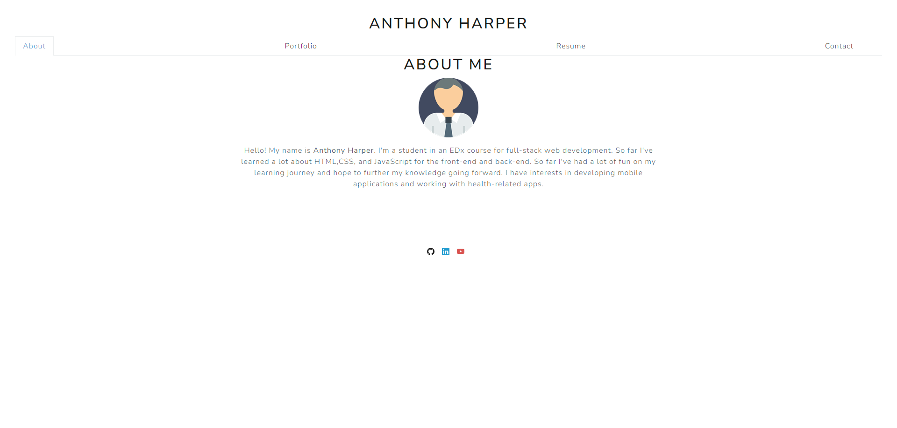
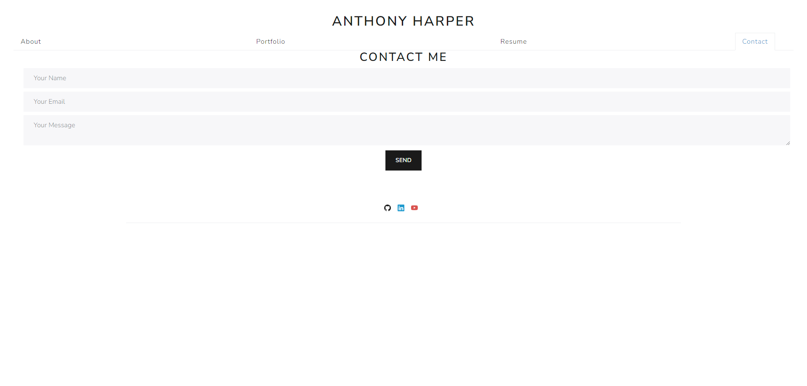

# React Portfolio

## Intro
The React Portfolio is a static webpage that is built mainly with Vite and React, rendered on Netlify. It's main purpose is to showcase the author's ability to utilize the languages learned so far.

## Usage
Users can view the page by visiting the live link in the URLs section.
There are four tabs to visit on the page: About Me, Contact Me, Portfolio, and Resume.  
## URLs
[Github Repo](https://github.com/aharper2568/react-portfolio)\
[Live URL](https://jocular-gecko-ce0b74.netlify.app/)

## Screenshots

## Author and Contributions
Developed in VSCode by **Anthony Harper**

- [Code I mirrored to validate email](https://stackoverflow.com/questions/46155/how-can-i-validate-an-email-address-in-javascript)
